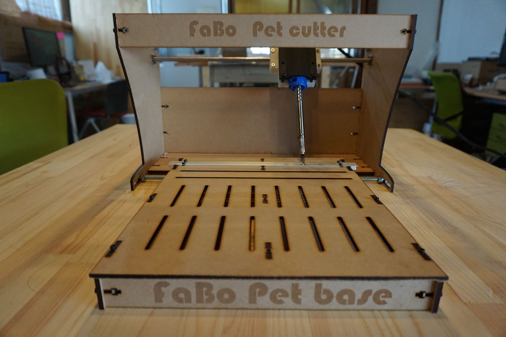

# PetCutter

## Material

### Petcutter
* Hex screw
	* M3*15 - 22
	* M3*12 - 16
	* M3 nat - 38
* Linear Shaft
	* M8*400 - 2 
https://www.monotaro.com/g/01344533/
* linear Push
	* Linear Bush LM 8UU - 4 
https://www.monotaro.com/p/0723/1384/
* Alumi Angle
	* Alumi angle 9x9x1000 - 1 
	https://www.monotaro.com/p/4035/5664/?displayId=5
* Hot Knife
	* goot Hot Knife HOT-60R 
https://www.amazon.co.jp/gp/product/B0016V7JII/ref=oh_aui_detailpage_o02_s00?ie=UTF8&psc=1

### Petcutter's jig
* Hex screw
	* M3*15 - 16

